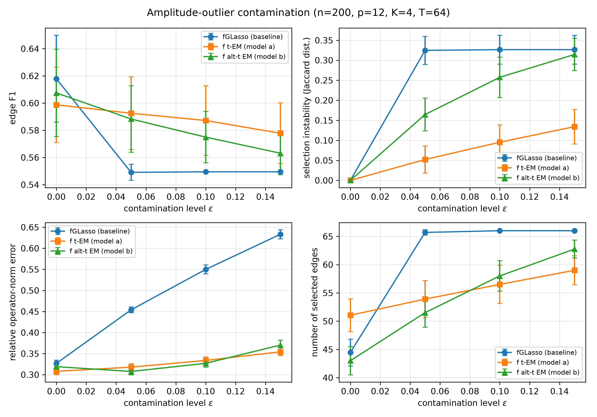

# Robust functional graphical models with heavy-tailed contamination

Code, experiments, and results for a research project on conditional-independence
networks among random functions when the observed curves are contaminated by
heavy-tailed noise or gross outliers.

The Gaussian functional graphical lasso of Qiao, Guo and James (2019) assumes
multivariate normal basis coefficients. Under contamination it breaks down
sharply: in our simulations, 10% of contaminated curves are enough to push the
baseline to select the **complete graph** (66 selected edges against 25 true
ones). This repository implements three contamination models, a penalized-EM
estimator for each of them, and the full simulation and real-data pipelines
used in the paper.



*Pilot study: graph selection metrics versus contamination level for the
whole-curve amplitude mechanism (p = 12 functions, K = 4 basis coefficients,
n = 200, 20 paired replicates).*

## Contamination models

| Model | Data-generating mechanism | Scale structure | Conditional-independence semantics |
|---|---|---|---|
| (a) classical functional t-process | heavy-tailed per-curve scales, shared across channels | one scale per curve | conditional uncorrelatedness |
| (b) functional alternative t-process | heavy-tailed per-curve, per-channel scales | one scale per (curve, channel) | conditional independence |
| (c) sporadically contaminated process | Bernoulli indicators times an arbitrary outlier process | none (unbounded outliers) | conditional independence |

## Estimator

All three models are fitted by penalized EM:

- E-step: posterior weights from the corresponding t or contamination model.
- M-step: block graphical lasso on the weighted covariance, solved by ADMM
  with a closed-form eigenvalue shrinkage step and vectorized group
  soft-thresholding.
- Robust initialization: weights seeded from diagonal median/MAD Mahalanobis
  distances, which keeps the EM out of the outlier-inflated local minimum.
- ECME profiling of the degrees-of-freedom parameter ν.
- Weighted covariance normalized by the total weight (not n), so the penalty
  scale is directly comparable between the Gaussian and robust estimators.

The paper develops selection theory for model (a): an oracle-weight error
rate with explicit constants, obtained from a self-normalization identity
for the t-weights, and graph selection consistency under a nodewise block
irrepresentability condition that is verified numerically for all designs
considered.

## Results at a glance

Whole-curve amplitude contamination, ε = 0.10 (means over 20 paired
replicates, 25 true edges):

| Method | F1 | Edges selected | Instability | Operator error vs clean |
|---|---|---|---|---|
| Gaussian fGLasso | 0.549 | 66.0 (complete graph) | 0.33 | +68% |
| t-process EM, model (a) | 0.587 | 56.5 | 0.10 | +8% |

The robust estimator matches the baseline on clean data (F1 0.599 vs 0.618,
and its clean operator error is actually lower), so the stabilization is
free.

Under channel-local blink artifacts of stressed strength (4 of 12 channels),
mean F1 at ε = 0.10 is 0.278 for the Gaussian baseline, 0.348 for the
shared-scale model (a), and **0.421 for the per-channel model (b)**, which
also has the best clean-data F1 (0.531 vs 0.411). This is the regime where
per-channel isolation matters and model (b) pays off.

On real EEG data (UCI Eye State) with injected blinks, the Gaussian
baseline's apparent low network drift is misleading: its reference graph is
already saturated on artifact-laden data. Model (a) over-reacts (whole-curve
weights discard the clean channels of blink trials), while model (b) reacts
in a targeted way. All numbers are reproduced by the scripts below and
stored under `results/`.

## Repository layout

```
robust-functional-ggm/
├── src/
│   ├── fgm.py                 core module: simulation with known block-sparse
│   │                          graph, block-glasso ADMM, functional t-process EM
│   │                          (models a and b), contamination, metrics
│   ├── test_fgm.py            unit tests: basis, ADMM KKT, simulation, EM weights
│   └── test_altt.py           unit tests for the per-channel model (b)
├── experiments/
│   ├── run_pilot.py           pilot sweep: 3 methods x ε grid, go/no-go verdict
│   ├── run_spike_stress.py    stressed blink-artifact study (mechanism iii)
│   ├── run_full_sim.py        full factorial grid (n, p, K, ε, ν axes)
│   ├── run_p50_sens.py        p = 50 high-dimension cell
│   ├── run_weak_edge.py       weak-edge cell: estimation-limited regime
│   ├── run_bridge_cell.py     bridge cell: regime becomes estimable at n = 800
│   ├── run_retune_control.py  retuned-baseline control (robustness vs penalty)
│   ├── run_eeg.py             UCI EEG Eye State application
│   ├── check_irrep.py         numerical check of the irrepresentability condition
│   ├── make_full_sim_figs.py  figures and tables from the result CSVs
│   └── make_numbers.py        inject numbers into the paper draft
├── results/                   per-replicate CSVs, summaries, run logs
├── figures/                   paper figures (png + pdf)
├── data/                      EEG Eye State (UCI Machine Learning Repository)
└── PILOT_REPORT.md            pilot design, results, and go/no-go record
```

## Getting started

Python 3.10 or newer with numpy, scipy, pandas, and matplotlib.

```bash
python3 -m pip install -r requirements.txt
```

## Reproducing the experiments

All simulations use explicit, fixed seeds (the graph seed is decoupled from
the noise seed), and every experiment writes per-replicate rows to
`results/`, so a run can be resumed after interruption.

```bash
# 1. unit tests (10 tests, all must pass)
python3 src/test_fgm.py
python3 src/test_altt.py

# 2. pilot study (~2 min)
python3 experiments/run_pilot.py

# 3. full simulation grid (long-running, checkpoints per replicate)
python3 experiments/run_full_sim.py
python3 experiments/run_p50_sens.py
python3 experiments/run_weak_edge.py
python3 experiments/run_bridge_cell.py
python3 experiments/run_retune_control.py
python3 experiments/check_irrep.py

# 4. EEG application (reads data/EEG Eye State.arff, no download needed)
python3 experiments/run_eeg.py

# 5. regenerate figures and tables from the result CSVs
python3 experiments/make_full_sim_figs.py
python3 experiments/make_numbers.py
```

`make_numbers.py` writes the LaTeX inputs consumed by the paper draft, which
is kept out of this public repository while it is in preparation; skip it
unless you also have the manuscript directory.

## Data

The application uses the [EEG Eye State
dataset](https://archive.ics.uci.edu/dataset/264/eeg+eye+state) from the UCI
Machine Learning Repository: 14 EEG channels from a single subject, eye-state
labels. Preprocessing (common average referencing, 0.5 s epochs, K = 6
cosine basis, coefficient standardization, winsorization at 8 MAD) is
implemented in `experiments/run_eeg.py`.

## Citation

```bibtex
@unpublished{mishra2026rfgm,
  title  = {Robust functional graphical models with heavy-tailed contamination},
  author = {Mishra, Ramakrushna},
  note   = {Manuscript in preparation},
  year   = {2026}
}
```
